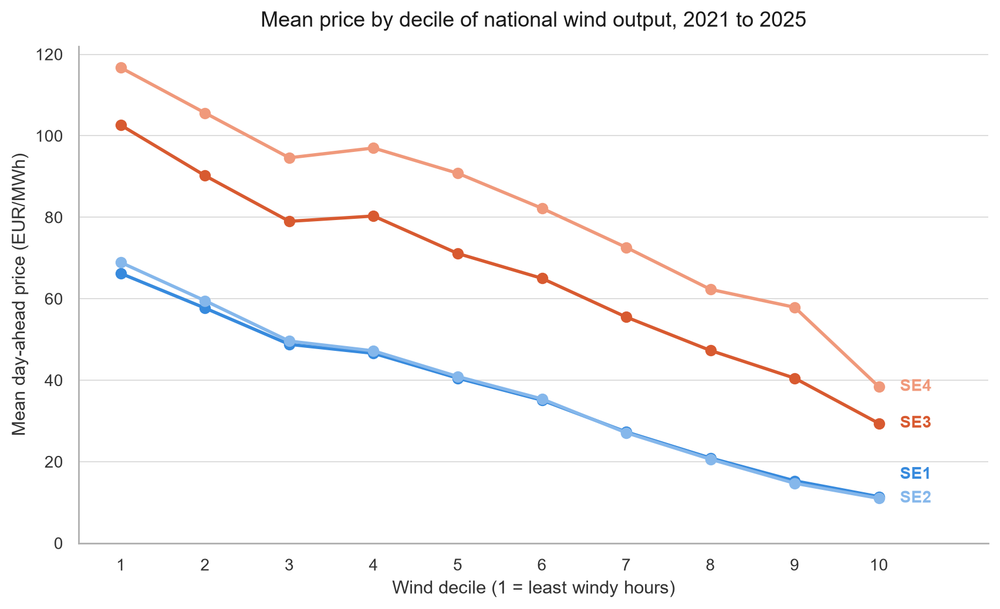
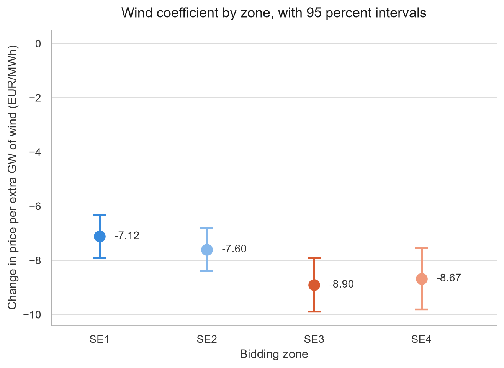
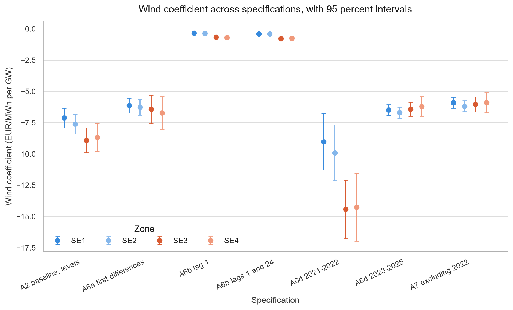

# Swedish Wind Generation and Electricity Prices, 2021 to 2025

An empirical analysis of how Swedish wind generation relates to day-ahead electricity prices across the four bidding zones SE1 to SE4, over 2021 to 2025.

## Finding

**An additional gigawatt of Swedish national onshore wind generation is associated with a 7 to 9 EUR/MWh lower day-ahead price, and the association is significantly stronger in the two southern zones.**



Sorting all 171,478 zone-hours into ten equally sized buckets by national wind output gives the raw picture before any model: every zone is cheaper in windier hours, and the two southern zones start higher and fall further.

## Results

Hourly regressions, one per zone, of price on wind, load, solar, temperature and net cross-border flow, with hour, month and year dummies and Newey-West standard errors at 24 lags:

| Zone | Wind coefficient (EUR/MWh per GW) | Std. error | 95% interval | n | R² |
|------|-----------------------------------|-----------|--------------|------|------|
| SE1  | -7.12 | 0.41 | [-7.91, -6.32] | 42,743 | 0.403 |
| SE2  | -7.60 | 0.40 | [-8.39, -6.82] | 42,730 | 0.404 |
| SE3  | -8.90 | 0.50 | [-9.89, -7.92] | 42,949 | 0.478 |
| SE4  | -8.67 | 0.58 | [-9.81, -7.54] | 43,056 | 0.425 |



Four separate regressions producing four different numbers does not by itself establish that the zones differ. A single stacked regression with zone fixed effects and wind interacted with zone, standard errors clustered on 7,272 zone-days over 171,478 observations, tests this directly:

| Term | Coefficient | Std. error | p |
|------|-------------|-----------|-------|
| Wind (SE1 baseline) | -6.94 | 0.35 | < 0.001 |
| Wind × SE2 | -0.26 | 0.45 | 0.561 |
| Wind × SE3 | -1.90 | 0.51 | 0.0002 |
| Wind × SE4 | -2.41 | 0.56 | < 0.001 |
| **Joint F on the three interactions** | **9.60** | df = 3 | **2.5 × 10⁻⁶** |

SE2 is statistically indistinguishable from SE1. SE3 and SE4 are each associated with a roughly 2 EUR/MWh per GW stronger price response than SE1, and the three interactions are jointly significant.

The sign and order of magnitude hold across every specification tried, including first differences, dropping 2022, and restricting to 2023 onwards. The two lagged-price rows sit near zero because they measure a different quantity, the within-hour innovation, and 2021 to 2022 sits far lower because the gas crisis was its own regime. Both are discussed under [Methods](#methods).



All statements here are associational. No exogenous variation in wind generation is used, so none of these coefficients should be read as a causal effect. See [Limitations](#limitations).


## Data sources

| Source | What it provides | Frequency | Coverage | Licence |
|--------|-----------------|-----------|----------|---------|
| Svenska kraftnat open data portal (data.svk.se), dataset "Market data day-ahead prices", which republishes Nord Pool day-ahead prices | Spot price by bidding zone, EUR/MWh | Hourly to 30 Sep 2025, 15-minute from 1 Oct 2025 | 2021-01-01 to 2025-12-31, SE1 to SE4. The dataset stopped updating after 1 July 2026 | See note below |
| SCB (Statistics Sweden), Statistical Database | Electricity production, net, and usage in GWh by category and bidding zone | Monthly | 2021M01 to 2025M12 | SCB open data, free to use with attribution |
| SMHI Open Data, meteorological observations | Air temperature in degrees Celsius, one reference station per zone | Hourly (with sparser early records) | 2021-01-01 to 2025-12-31 | SMHI open data, CC BY 4.0 |
| Energy-Charts, Fraunhofer ISE, `cbpf` endpoint | Cross-border physical flows between Sweden and six neighbours, GW, negative means export from Sweden | Hourly to 2024, 15-minute in 2025 | 2021 to 2025, national | **CC BY 4.0** |
| Energy-Charts, Fraunhofer ISE, `public_power` endpoint | National generation by production type and load, MW | Hourly | 2021 to 2025, national | **CC BY 4.0** |

**Energy-Charts attribution requirement.** Data from Energy-Charts is published by Fraunhofer ISE under Creative Commons Attribution 4.0 International (CC BY 4.0). Any use, redistribution or derivative work must credit the source, for example: *Data source: Energy-Charts, Fraunhofer Institute for Solar Energy Systems ISE, licensed under CC BY 4.0 (https://creativecommons.org/licenses/by/4.0/)*. This applies to `data/clean/clean_flows_hourly.csv`, `data/clean/clean_generation_hourly.csv`, to every panel built from them, and to any chart in `figures/` that displays generation, load or flow data.

### Where the raw files came from

| File in this repository | Origin |
|-------------------------|--------|
| `data/raw/spot_prices_se1_se4_2021_2025.csv.csv` | Svenska kraftnat open data portal, https://data.svk.se/, dataset "Market data day-ahead prices", which republishes Nord Pool day-ahead prices. Columns are `_id, start_time_sweden, start_time_utc, bidding_zone, price, price_unit`. The dataset stopped updating after 1 July 2026, so it cannot be used to extend the series past that date. |
| `data/raw/scb_production_consumption_monthly_2021_2026.csv.csv` | SCB Statistical Database, https://www.statistikdatabasen.scb.se/, table "Electricity production, net and usage, in GWh by Production and usage, bidding zone and month" |
| `data/raw/SE1 Luleå-Kallax.csv` | SMHI Open Data, https://www.smhi.se/data/meteorologi/ladda-ner-meteorologiska-observationer, parameter Lufttemperatur, station 162860 Luleå-Kallax Flygplats |
| `data/raw/SE2 Östersund-Frösön.csv` | SMHI Open Data, same portal, station 134110 Östersund-Frösön Flygplats |
| `data/raw/SE3 Stockholm-Arlanda.csv` | SMHI Open Data, same portal, station 97400 Stockholm-Arlanda Flygplats |
| `data/raw/SE4 Helsingborg A.csv` | SMHI Open Data, same portal, station 62040 Helsingborg A |
| `data/raw/flows_se_2021.json` … `data/raw/flows_se_2025.json` | Energy-Charts API, https://api.energy-charts.info/, cross-border physical flows for `country=se`, one file per year |
| `data/raw/generation_se_2021.json` … `data/raw/generation_se_2025.json` | Energy-Charts API, https://api.energy-charts.info/, public power for `country=se`, one file per year |

The four SMHI stations stand in for their zones. They are reference points, not zone averages.

## Pipeline

Run the five notebooks in `notebooks/` in numerical order. Each one is self-contained and reruns from its inputs. They resolve the repository root, so you can start Jupyter from either the repository root or `notebooks/`; raw inputs are in `data/raw/`, cleaned data and CSV panels are in `data/clean/`, and figures and tables are written to the root `figures/` and `tables/` folders.

| Notebook | Reads | Produces |
|----------|-------|----------|
| `notebooks/01_data_cleaning.ipynb` | The raw CSV and JSON files listed above | `data/clean/clean_prices_hourly.csv` (171,959 rows), `data/clean/clean_scb_monthly.csv` (2,880), `data/clean/clean_temperature_hourly.csv` (174,813), `data/clean/clean_flows_hourly.csv` (43,824), `data/clean/clean_generation_hourly.csv` (43,824) |
| `notebooks/02_load_to_sql.ipynb` | The five cleaned CSVs | Five tables in the PostgreSQL database `swedish_electricity` |
| `notebooks/03_build_panels.ipynb` | The five PostgreSQL tables | `panel_hourly` (171,478 × 28) and `panel_monthly` (240 × 37) in PostgreSQL, plus `data/clean/panel_hourly.csv` and `data/clean/panel_monthly.csv` |
| `notebooks/04_exploratory_analysis.ipynb` | `panel_hourly`, `panel_monthly` | 13 PNG figures in `figures/` at 200 dpi, plus a 1080 x 1350 copy of the wind-decile chart in `figures/linkedin/` |
| `notebooks/05_econometrics.ipynb` | `panel_hourly`, `panel_monthly` | 12 regression tables in `tables/`, 3 further figures in `figures/`, plus two more 1080 x 1350 copies in `figures/linkedin/` |

Notebooks 04 and 05 read from PostgreSQL and write nothing back to it. Only notebooks 02 and 03 write to the database.

### Recreating the database

`notebooks/02_load_to_sql.ipynb` expects a PostgreSQL database named `swedish_electricity` to already exist. Create it once:

```sql
CREATE DATABASE swedish_electricity;
```

Then run `notebooks/02_load_to_sql.ipynb`, which creates and populates `prices_hourly`, `scb_monthly`, `temperature_hourly`, `flows_hourly` and `generation_hourly` from the cleaned CSVs. `notebooks/03_build_panels.ipynb` then builds `panel_hourly` and `panel_monthly` on top of those five tables without modifying them.

Local time conversion is done in PostgreSQL with `AT TIME ZONE 'Europe/Stockholm'` so that daylight saving transitions are handled correctly rather than by a fixed offset.

## Repository structure

```
.
├── README.md
├── .gitignore
├── .env.example                    # copy to root .env and set PG_URL
│
├── data/
│   ├── raw/                        # six source CSVs and ten Energy-Charts JSON files
│   │   ├── spot_prices_se1_se4_2021_2025.csv.csv
│   │   ├── scb_production_consumption_monthly_2021_2026.csv.csv
│   │   ├── SE1 Luleå-Kallax.csv
│   │   ├── SE2 Östersund-Frösön.csv
│   │   ├── SE3 Stockholm-Arlanda.csv
│   │   ├── SE4 Helsingborg A.csv
│   │   ├── flows_se_2021.json … flows_se_2025.json
│   │   └── generation_se_2021.json … generation_se_2025.json
│   └── clean/                      # regenerated by notebooks 01 and 03
│       ├── clean_prices_hourly.csv
│       ├── clean_scb_monthly.csv
│       ├── clean_temperature_hourly.csv
│       ├── clean_flows_hourly.csv
│       ├── clean_generation_hourly.csv
│       ├── panel_hourly.csv
│       └── panel_monthly.csv        # small enough to track
│
├── notebooks/
│   ├── 01_data_cleaning.ipynb       # raw files to five tidy CSVs
│   ├── 02_load_to_sql.ipynb         # CSVs to PostgreSQL
│   ├── 03_build_panels.ipynb        # joins, calendar variables, two panels
│   ├── 04_exploratory_analysis.ipynb # descriptives, merit order, time series properties
│   └── 05_econometrics.ipynb        # Parts A and B, all regressions
│
├── sql/
│   └── Valentino Db.sql
│
├── figures/                        # 16 PNG, 200 dpi
│   ├── 02_daily_price_by_zone.png
│   ├── 02_price_boxplot_by_zone.png
│   ├── 02_spread_se4_se1.png
│   ├── 03_hexbin_wind_vs_price.png
│   ├── 03_price_by_wind_decile.png
│   ├── 03_price_by_wind_decile_by_year.png
│   ├── 04_price_by_hour_and_month.png
│   ├── 04_wind_and_load_profiles.png
│   ├── 05_correlation_heatmap.png
│   ├── 06_acf_pacf_se3.png
│   ├── 07_net_position_by_zone.png
│   ├── 07_production_mix_by_zone.png
│   ├── 07_wind_share_vs_price.png
│   ├── 08_spread_and_net_position.png
│   ├── 08_wind_coef_across_specs.png
│   ├── 08_wind_coef_by_zone.png
│   └── linkedin/                   # 1080 x 1350 copies of the three headline charts
│       ├── 03_price_by_wind_decile.png
│       ├── 08_wind_coef_across_specs.png
│       └── 08_wind_coef_by_zone.png
│
└── tables/                         # 12 regression tables, CSV
    ├── a1_johansen_trace.csv
    ├── a1_engle_granger.csv
    ├── a2_baseline_by_zone.csv
    ├── a3_zone_interaction.csv
    ├── a4_residual_load.csv
    ├── a5_iv_load.csv
    ├── a5_ols_vs_iv.csv
    ├── a6c_wind_x_2022.csv
    ├── a6_a7_wind_across_specifications.csv
    ├── b1_zone_means.csv
    ├── b2_monthly_panel.csv
    └── b3_spread_regression.csv
```

Not tracked: `.env`, which holds the database credentials, plus the regenerable outputs `data/clean/clean_*.csv`, `data/clean/panel_hourly.csv` and `.ipynb_checkpoints/`. See `.gitignore`.

## Methods

**Units.** Generation, load and flow variables are converted from MW to GW before estimation, so every coefficient reads as EUR/MWh per additional GW.

**Hourly zone-level regressions (A2).** Price regressed on onshore wind, load, solar, temperature and the summed net cross-border flow, with hour-of-day, month and year dummies, estimated separately for each zone. Standard errors are Newey-West with 24 lags. The lag length is set by the daily cycle visible in the ACF rather than by a rule of thumb, since 24 is the minimum that covers a full day.

**Cointegration (A1).** Johansen trace test with 24 lagged differences on the four balanced zone price series (41,337 hours), plus pairwise Engle-Granger. Johansen rejects every null in the sequence including r ≤ 3, which is full rank and therefore indicates stationarity in levels rather than three cointegrating vectors among I(1) series. Engle-Granger agrees: residual statistics of -17.30 (SE1 and SE2), -16.21 (SE3 and SE4) and -11.29 (SE1 and SE4) against a 5 percent critical value of -3.34.

**Zone-interaction test (A3).** A single stacked regression across all four zones with zone fixed effects and wind interacted with zone, standard errors clustered on zone-day (7,272 clusters), and an F-test on the three interaction terms jointly.

**Residual-load specification (A4).** Energy-Charts defines residual load as load minus wind minus solar, so wind is already contained in it. Wind and residual load are therefore never entered together. This specification replaces wind, load and solar with residual load alone and is reported as a different question, not a better version of A2. Coefficients: 6.55 (SE1), 6.93 (SE2), 9.93 (SE3), 10.23 (SE4) EUR/MWh per GW.

**Instrumented load (A5).** Load is instrumented with temperature. The first stage is strong, with F between 602 and 959. The exclusion restriction is not defensible in a hydro-dominated system, because temperature plausibly reaches price through snowmelt and reservoir inflow, through heating-driven CHP output, and through the correlation between cold snaps and low wind. Reported only as a diagnostic on the direction of the load endogeneity bias, not as a preferred estimate.

**Robustness (A6, A7).** The wind coefficient across specifications, EUR/MWh per GW:

| Specification | SE1 | SE2 | SE3 | SE4 |
|---------------|-----|-----|-----|-----|
| A2 baseline, levels | -7.12 | -7.60 | -8.90 | -8.67 |
| First differences | -6.13 | -6.27 | -6.42 | -6.72 |
| Lagged price, 1 lag | -0.33 | -0.36 | -0.66 | -0.69 |
| Lagged price, lags 1 and 24 | -0.40 | -0.41 | -0.78 | -0.76 |
| 2021 to 2022 only | -9.02 | -9.90 | -14.42 | -14.26 |
| 2023 to 2025 only | -6.48 | -6.71 | -6.43 | -6.20 |
| Excluding 2022 | -5.90 | -6.18 | -6.03 | -5.89 |

The lagged-price rows measure a different quantity. With the previous hour's price on the right-hand side the R² rises to 0.92 to 0.96 and the coefficient captures only the within-hour innovation, not the full association.

The 2022 gas crisis is a distinct regime. Interacting wind with a 2022 indicator gives a wind coefficient of -5.05 to -5.88 outside 2022 and -13.86 to -25.11 within it, with every interaction significant at p < 0.001.

**Charts.** The three headline figures share one palette, two blues for the northern zones and two oranges for the southern pair, so the north/south split is legible before the legend is read. They are written at 200 dpi, with a 1080 x 1350 portrait copy of each in `figures/linkedin/`. Every series is direct-labelled or separated by position as well as by colour, because two of the four fills fall below a 3:1 contrast ratio against white.

**Monthly panel (B).** 240 observations, four zones by sixty months. Production shares rather than levels, since the zones differ by an order of magnitude in size. Estimated pooled and with entity fixed effects, standard errors clustered by zone. Within-zone, a percentage point of wind share is associated with -1.19 EUR/MWh (FE) and -1.04 (pooled); net export share with -0.19 (FE) and -0.39 (pooled). Pooled R² 0.287, FE within R² 0.553. A separate regression models the SE4 minus SE1 spread directly on 60 monthly observations with HAC standard errors at 6 lags.

## Limitations

**Generation data is national, not zonal.** Energy-Charts does not serve Swedish generation at bidding-zone level. The `bzn` parameter is silently ignored and returns German data. Every wind, solar, load and residual-load figure in this project is therefore a single national series matched against four different zone prices. The zone coefficients measure each zone's price response to the national fleet, not to turbines located inside that zone.

**Inter-zone transmission flows were not obtainable.** Cross-border flows are available only at national level, and flows between SE1, SE2, SE3 and SE4 are not in the data at all. This is the binding constraint on the second research question. The monthly spread regression, SE4 minus SE1 price on the differences in wind share, net position and temperature, explains 11 percent of the variance (R² 0.110) with a joint F p-value of 0.114. Only the wind-share difference is individually significant, at -1.02 EUR/MWh per percentage point (p = 0.025). The spread, which averages 44.85 EUR/MWh over the sixty months, behaves like a level shift that these covariates do not track. The project describes the north-south gap but cannot identify it.

**No exogenous variation in wind.** Wind generation is not randomly assigned and is correlated with weather that reaches price through other channels. All results are associational. The instrumental-variables specification in A5 does not fix this, because it instruments load rather than wind, and its own exclusion restriction is doubtful.

**Unit root tests disagree in levels.** ADF rejects a unit root while KPSS rejects stationarity for the level price series, which is the usual signature of a bounded but strongly persistent series with fat tails. Level and first-differenced specifications nevertheless give consistent conclusions on sign and order of magnitude, so this does not appear to drive the result.

**Four clusters in Part B.** Standard errors clustered by zone rest on four clusters. Cluster-robust inference is asymptotic in the number of clusters, so the Part B p-values should be read as suggestive. Part B is reported as description and as a cross-check on Part A, not as standalone evidence.

**Temperature is measured at four reference stations**, one per zone, not as a population-weighted or area-weighted zone average.

**Two resolution changes in the source data.** Nord Pool moved from hourly to 15-minute settlement on 1 October 2025, and the Energy-Charts 2025 flow series is 15-minute. Both are aggregated to hourly means in `notebooks/01_data_cleaning.ipynb`. Solar and fossil gas are zero-filled for 8,352 hours in 2021 where Energy-Charts returns null, on the grounds that output in those categories was negligible.

## How to reproduce

### Requirements

- Python 3.11 or later
- PostgreSQL 14 or later, running locally
- Python packages:

```bash
pip install pandas numpy matplotlib seaborn statsmodels linearmodels arch sqlalchemy psycopg2-binary python-dotenv jupyter nbformat
```

### Connection setup

No credentials are stored in the notebooks. All four database notebooks load the repository-root `.env` file with python-dotenv, independently of whether the working directory is the repository root or `notebooks/`:

```python
import os
from pathlib import Path
from dotenv import load_dotenv
from sqlalchemy import create_engine

PROJECT_ROOT = next(
    path for path in (Path.cwd(), *Path.cwd().parents)
    if (path / "data" / "raw").is_dir() and (path / "notebooks").is_dir()
)
load_dotenv(PROJECT_ROOT / ".env")
engine = create_engine(os.environ["PG_URL"])
```

Copy the repository-root `.env.example` to `.env` in the same directory and fill in your own credentials:

```
PG_URL=postgresql+psycopg2://<user>:<password>@localhost:5432/swedish_electricity
```

`.env` is gitignored and must never be committed. `.env.example` is tracked and carries only the placeholder.

### Run order

1. Copy the repository-root `.env.example` to `.env` in the repository root and set `PG_URL`, then run `CREATE DATABASE swedish_electricity;`. Start Jupyter from the repository root or `notebooks/`.
2. Run `notebooks/01_data_cleaning.ipynb` from top to bottom. It reads the raw files in `data/raw/` and writes the five `data/clean/clean_*.csv` files.
3. Run `notebooks/02_load_to_sql.ipynb`. It loads those five CSVs into PostgreSQL.
4. Run `notebooks/03_build_panels.ipynb`. It creates `panel_hourly` and `panel_monthly` and exports them to `data/clean/panel_hourly.csv` and `data/clean/panel_monthly.csv`.
5. Run `notebooks/04_exploratory_analysis.ipynb`. It writes 13 figures to `figures/` and one to `figures/linkedin/`.
6. Run `notebooks/05_econometrics.ipynb`. It writes 12 tables to `tables/`, 3 more figures to `figures/` and two more to `figures/linkedin/`.

Notebooks 01 and 03 take a few minutes each. Notebook 05 takes longer, mostly the Johansen test with 24 lagged differences on roughly 41,000 observations and the per-zone IV estimation.

## Licence and attribution

Code in this repository may be reused freely. The data is not all under the same terms. Energy-Charts data is CC BY 4.0 and carries the attribution requirement set out above. SMHI open data is CC BY 4.0. SCB data is open with attribution. The day-ahead price data comes from Svenska kraftnat's open data portal, which republishes Nord Pool prices; confirm Svenska kraftnat's terms and any Nord Pool conditions passed through them before redistributing this repository publicly.
